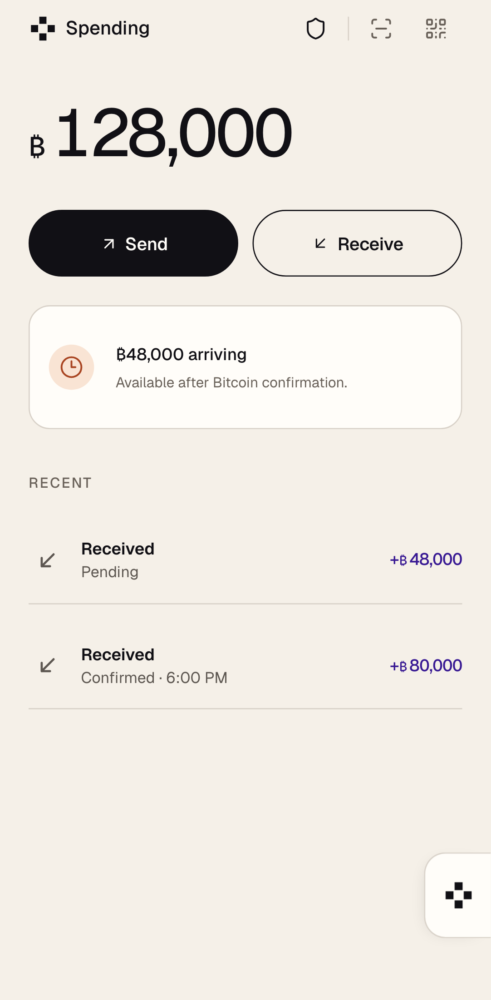
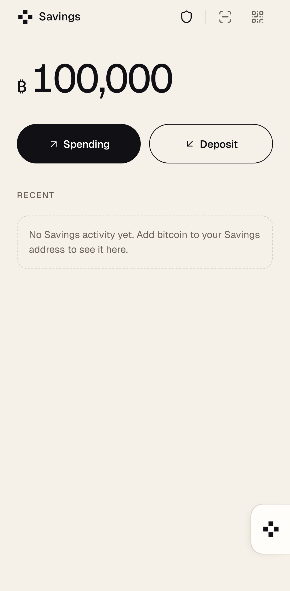
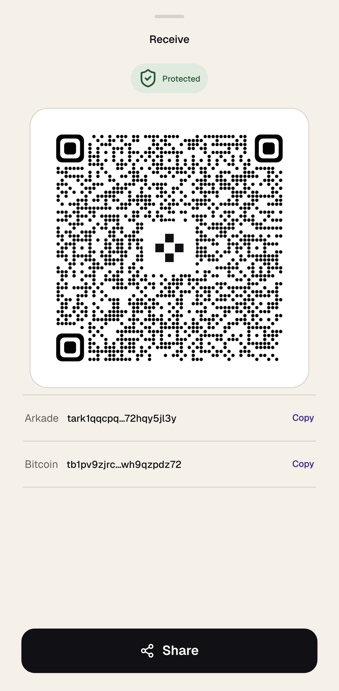
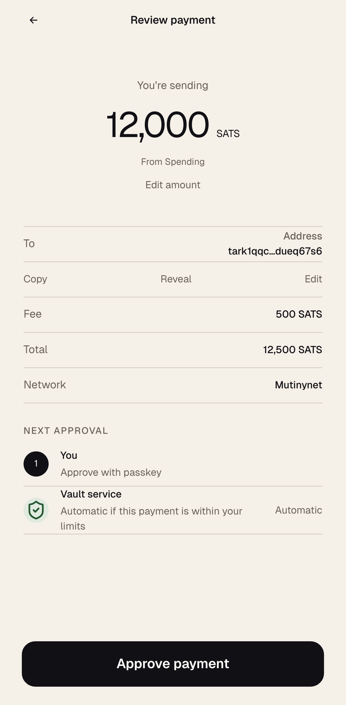
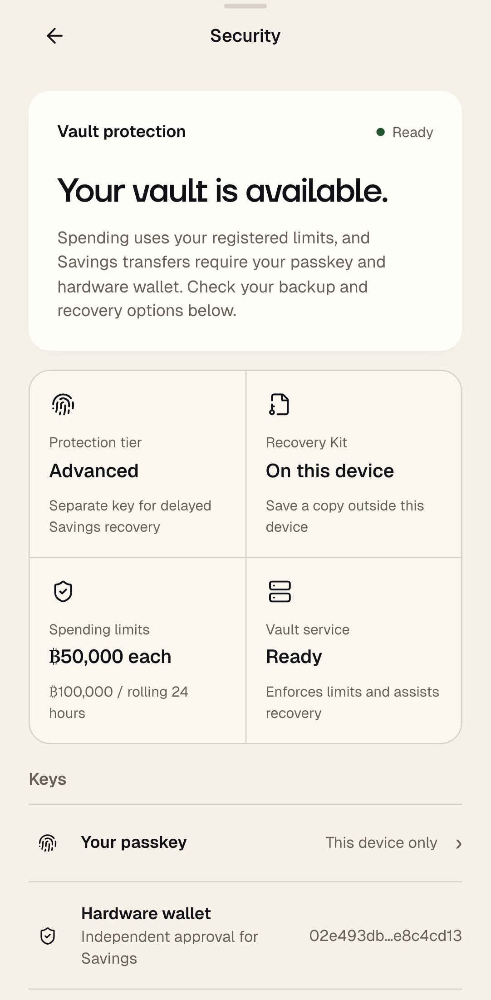
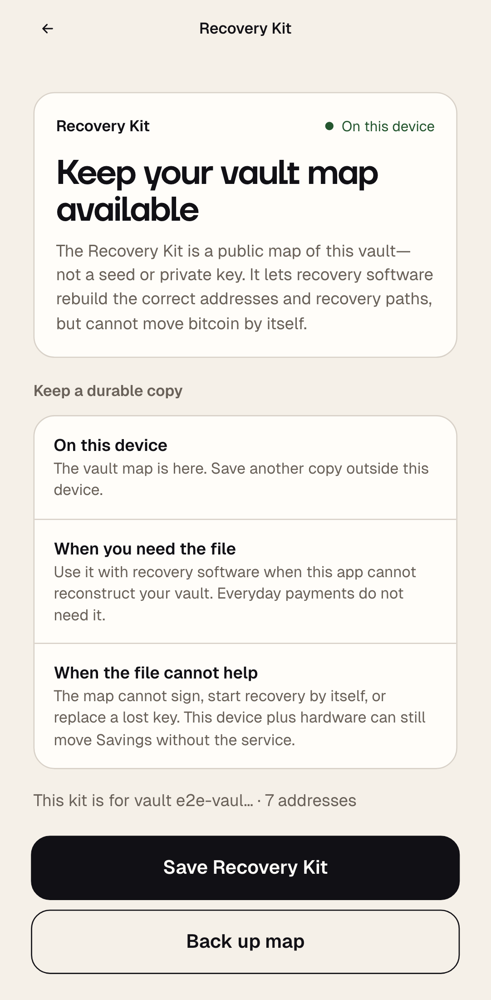

# Vaulted, a Bitcoin wallet

Vaulted is a passkey-first Bitcoin wallet that separates everyday spending
from hardware-protected savings, with Bitcoin ownership, policy, and recovery
at the center of the product.

> [!WARNING]
> The public release candidate runs on **Mutinynet only**. Do not use real
> funds. Mainnet activation remains gated by the qualification work described
> below.

[Open the Mutinynet release candidate](https://arkade-vault-mutinynet-rc.vercel.app)
· [Read the documentation](docs/README.md)
· [View the Vault service](https://github.com/brg444/arkade-vault-server)

## What it does

- **Spending** is the fast, policy-controlled side of the wallet, with enrolled
  per-payment and rolling 24-hour limits enforced by the Vault service.
- **Savings** holds bitcoin in the L1 `arkade-vault/savings-v1` program.
  Ordinary transfers require both this device and an external hardware signer.
- **Recovery** gives Advanced vaults delayed, cancellable recovery paths and a
  portable Recovery Kit without placing private keys in the browser.
- **Unified receive** provides one Bitcoin payment request for both fast and
  onchain receipt.

Enrollment requires an invitation from the Vault service operator. It freezes
the selected protection tier and spending policy before the passkey is created.

## Wallet

### Home

<table>
  <tr>
    <td width="50%">
      <strong>Spending</strong><br><br>
      
    </td>
    <td width="50%">
      <strong>Savings</strong><br><br>
      
    </td>
  </tr>
</table>

### Send and receive

<table>
  <tr>
    <td width="50%">
      <strong>Receive bitcoin</strong><br><br>
      
    </td>
    <td width="50%">
      <strong>Review every payment</strong><br><br>
      
    </td>
  </tr>
</table>

### Protection and recovery

<table>
  <tr>
    <td width="50%">
      <strong>Security</strong><br><br>
      
    </td>
    <td width="50%">
      <strong>Recovery Kit</strong><br><br>
      
    </td>
  </tr>
</table>

These high-density Pixel 7 captures are generated from the current source
against deterministic wallet states. Run the `@docs` Playwright test to refresh
them.

## Programs and policy

Spending uses `vault-policy-v1`. The available presets are Lower exposure
(25,000 sats per payment and 50,000 sats per rolling 24 hours), Everyday
(50,000 and 100,000), or custom values for both limits. Authenticated fee
ceilings are release-managed at 5,000 sats and 10 sat/vB.

Standard protection has no recovery key. Advanced protection requires one and
exposes only the delayed recovery paths implemented by the Vault Program. The
complete descriptor, tier, and canonical policy digest are pinned locally and
in Recovery Kit version 3.

Confirmed Bitcoin payments enter the enrolled `vault-board-v1` program before
the official SDK settles them into Spending. Savings-to-Spending uses the same
path. See [VTXO boarding](docs/boarding.md) and the
[Vault Program specification](docs/program.md).

## Security model

The browser never receives the VaultCosigner key. Production screens do not
accept hardware or recovery private keys; those workflows exchange PSBTs with
an external signer.

One scoped worker owns the official SDK Wallet, Contract Manager, repositories,
and the boarding key provisioned after PRF unlock. The page does not receive
that key or run a parallel settlement lifecycle. Exact upstream revisions and
intentional adapters are recorded in
[upstream alignment](docs/upstream-alignment.md).

| Component                                                            | Responsibility                                                                                                          |
| -------------------------------------------------------------------- | ----------------------------------------------------------------------------------------------------------------------- |
| Vaulted                                                              | Enrollment, transaction construction, device authorization, external PSBT handoff, Operator coordination, and recovery. |
| [Arkade Vault Server](https://github.com/brg444/arkade-vault-server) | Immutable Vault Program records, rolling allowance, VaultCosigner policy, and transaction verification.                 |
| Arkade Operator                                                      | VTXO index, batch coordination, and release-pinned Operator signatures.                                                 |

The browser reaches the Vault service and Arkade Operator through same-origin
routes. Security guarantees, trust boundaries, and excluded claims are detailed
in [the security documentation](docs/security.md).

## Local development

Requires Node.js 20.19+ (or 22.12+) and pnpm:

```bash
pnpm install
pnpm start
```

The development server listens on
[http://localhost:3003](http://localhost:3003).

When a local Vault service uses a gateway secret, pass the value only to Vite:

```bash
VAULT_GATEWAY_SECRET=<local-gateway-secret> pnpm start
```

The development proxy adds the private header to `/v1` requests. Never use a
`VITE_` variable for this secret; Vite compiles those variables into browser
code.

Run the release checks with:

```bash
pnpm test:unit
pnpm lint
pnpm format:check
pnpm build
```

End-to-end and release qualification procedures are documented in
[docs/testing.md](docs/testing.md).

## Mainnet candidate

Mainnet must use a separate Vercel project and must not replace the Mutinynet
deployment. Build with `pnpm build:mainnet` and deploy using
`vercel --local-config vercel.mainnet.json`.

The mainnet environment requires a fresh authorizer through `AUTHORIZER_ORIGIN`
and `AUTHORIZER_GATEWAY_SECRET`, `VAULT_RELEASE_NETWORK=mainnet`, and
`UPSTASH_REDIS_REST_URL` plus `UPSTASH_REDIS_REST_TOKEN` for shared durable rate
limiting. The bundle, gateway, and service reject mismatched networks.
Lightning remains disabled because no mainnet solver profile is bundled.

Do not reuse the Mutinynet hostname, WebAuthn RP ID, secrets, vault records,
database, policy-sequence state, or Vercel project.

## Release status

Ordinary VTXO Spending supports fragmented inputs, exact no-change sends, the
Operator's bounded intent-fee policy, and recovery after ambiguous Operator
submission through the official SDK pending-transaction interface.

Mainnet activation remains blocked on live lifecycle qualification, browser
concurrency testing, production key isolation, and audited infrastructure
provisioning. The confirmed mainnet Emulator advertises the signer pinned by
the official SDK, but has not passed Vault release qualification. Vault Program
and policy-schema bounds also require a separate mainnet review.

Outbound BOLT11 support remains disabled. Its solver, refund, expiry, and
live-payment gates are recorded in [docs/lightning.md](docs/lightning.md). The
complete activation gate is in
[docs/mainnet-v2-baseline.md](docs/mainnet-v2-baseline.md).

Report vulnerabilities through [SECURITY.md](SECURITY.md), not a public issue.
