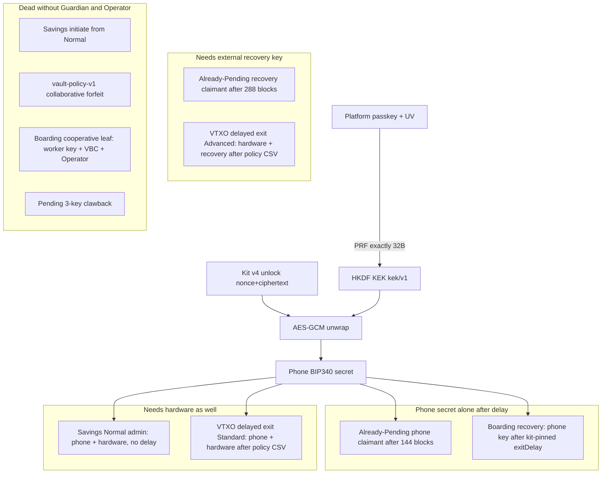
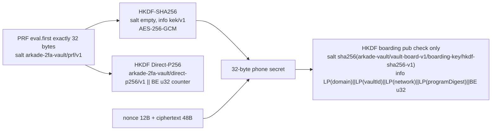
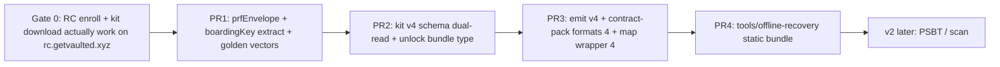

# Vaulted Offline Passkey-PRF Recovery Page

| Field | Value |
| --- | --- |
| **Author** | Vaulted / Arkade engineering |
| **Date** | 2026-09-04 |
| **Status** | Draft |
| **Audience** | Vaulted / Arkade engineers |
| **Type** | Later-product scope and architecture. Not an implementation task. |
| **Codebases** | Wallet `/private/tmp/arkade-wallet-qg-one-tap`; runtime `/private/tmp/arkade-runtime-mainnet-release` |

---

## Overview

Once RC enroll and Recovery Kit download work on `https://rc.getvaulted.xyz`, Vaulted still has no way to re-evaluate WebAuthn PRF after `getvaulted.xyz` and the Guardian are gone. The live wallet unwraps a **stored phone envelope** with a passkey-PRF KEK. That envelope today lives on the authorizer and in the local enrollment record (`EnrollmentSecrets`), **not** in Recovery Kit v3. Kit v3 is a public descriptor only.

The product is **kit v4 + a recovery-mode copy of the same app**, not a key-export page.

Kit v4 is the boot image: public map, RP ID, and the PRF-wrapped envelope. Opening that file instantiates Recover (the existing Savings / boarding / delayed-exit flows) with **no Guardian**. Face ID still runs on the enrolled origin. The app then lets the user escape funds on the paths that do not need VaultCosigner or Operator.

Two ways to run that app:

1. **Enrolled phone (preferred).** The installed PWA / cached SPA on the device that created the passkey. Kit v4 is already on disk. If DNS for `getvaulted.xyz` is dead, the service worker still has to serve the origin-bound app; WebAuthn still requires that hostname.
2. **Local laptop.** Recreate `https://rc.getvaulted.xyz` or `https://app.getvaulted.xyz` with `hosts` + a private local CA, load the same recovery-mode SPA, import kit v4.

It does not resurrect collaborative VTXO spend or Savings initiate. Normal Savings is still phone+hardware admin. Do not display the boarding worker scalar. Do not add a production “export PRF / WIF” screen.

The data-model change (Recovery Kit v4 + optional unlock-bundle sidecar) is designed to land **before** the offline page exists. Nuri’s local-origin WebAuthn trick is prior art for RP-ID recreation only. This design does **not** copy `nuri-prf-salt-v1`, BIP32, Ethereum, or WIF-as-a-live-app-product, and it does **not** add a production “export PRF / WIF” screen.

Gate 0 (RC enroll + kit download on `https://rc.getvaulted.xyz`) is a prerequisite, not a claim that those hosts are live. `docs/mainnet-v2-baseline.md` still treats the production names as intended surface until DNS, Vercel, and Guardian are provisioned.

---

## Background & Motivation

### Current state

Enrollment (`src/lib/vault/tenantEnrollment.ts`) does **not** derive the wallet seed from PRF. It:

1. Creates a platform passkey with PRF salt `arkade-2fa-vault/prf/v1`.
2. HKDF-derives a Direct-P256 identity (`arkade-2fa-vault/direct-p256/v1`) for session proofs. Enroll currently has a **local copy** of this helper that only returns `{ pub }` and throws *“authenticator did not return PRF”*; production unwrap and this design must use `src/lib/vault/ceremony/directauth.ts` (`deriveDirectP256`, counter `0..255`).
3. Samples a fresh 32-byte phone BIP340 secret.
4. Wraps that secret with AES-GCM under a KEK HKDF’d from PRF (`arkade-2fa-vault/kek/v1`, empty salt, 12-byte nonce, 48-byte ciphertext).
5. Derives the worker boarding key from the phone secret (`vault-board-v1/boarding-key`) and stages it in IndexedDB. That key is **cooperative boarding only**.
6. Saves Recovery Kit v3 from the **Savings** descriptor only (`buildRecoveryKit` in `src/lib/vault/program/kit.ts`). No envelope, no RP ID, no boarding pins.

Unlock (`decryptPhoneSecret` in `src/lib/vault/signIn.ts`, `unlockPhoneBip340` in `src/lib/vault/savingsSpend.ts`) re-evaluates PRF on the enrolled RP ID and decrypts the same envelope. Cross-device recover (`signInWithPasskey`) fetches that envelope from `POST /v1/passkey/recover` after a signed recovery binding (`arkade-vault/recovery-binding/v4`).

Recovery Kit v3 (`RECOVERY_KIT_NAME = 'arkade-recovery-kit'`, `RECOVERY_KIT_VERSION = 3`) carries:

```text
name, version, descriptor, descriptorHash, spendingPolicyDigest, protectionTier
```

`inspectRecoveryKit` already warns: *“Recovery cannot exit a Normal UTXO if both cosigners are gone.”* That warning is about **initiate** (`selectRoute` throws `initiate needs both cosigners` when `availableKeys.cosigners === false` in `src/lib/vault/program/route.ts`). It is **not** about Savings admin. The onboarding Kit screen (`src/screens/Vault/onboard/Kit.tsx`) tells the user the file contains no private keys. That is true for plaintext, and it is also why the file is insufficient once the authorizer is gone: the nonce and ciphertext never left `localStorage` key `arkade-vault-v2:enrollment:{vaultId}` or the Guardian envelope store (`policy.CredentialEnvelope` in `internal/policy/envelope.go`).

### Pain points

- A user who saved only Recovery Kit v3 cannot unwrap the phone key offline.
- WebAuthn RP ID **is** the hostname (`requireRPID` in `signIn.ts` / `tenantEnrollment.ts`; `VAULTED_RC_RP_ID` / `VAULTED_WALLET_RP_ID` in `src/lib/vault/productionDomains.ts`). After DNS for `getvaulted.xyz` dies, `navigator.credentials.get({ rpId })` fails unless that hostname resolves locally over HTTPS.
- Collaborative Spending (`vault-policy-v1` forfeit leaf) needs phone + VaultCosigner + Operator and is dead without them. What remains is **not** “phone-controlled delayed L1 for everything.” See [Spendability after Guardian and Operator are gone](#spendability-after-guardian-and-operator-are-gone).
- Production UI is locked against displaying raw hardware or recovery private keys (`src/screens/Vault/ui-lock.test.ts`, `docs/program.md`, `docs/security.md`). An emergency unwrap UI must not become a production screen.

### What is recoverable from PRF

| Material | Recoverable from passkey + envelope? | Spendable if Guardian+Operator are gone? |
| --- | --- | --- |
| Phone BIP340 secret | Yes — random 32 bytes wrapped by PRF-KEK | One key among the paths in the spendability table. Sufficient **alone** only for a mature Savings **phone-claimant Pending** UTXO, or mature `vault-board-v1` boarding recovery |
| `vault-board-v1` boarding worker key | Yes after unwrap (HKDF from phone secret) | **No.** Cooperative leaf needs VaultBoardCosigner + Operator (`contract-pack` `forfeit`) |
| Direct-P256 scalar | Yes (HKDF from PRF) | Not a Bitcoin key; session identity only |
| VaultCosigner / VaultBoardCosigner | **No** | Tenant service key |
| Arkade Operator signer | **No** | Release-pinned Operator |
| Hardware key | **No** | Never in the browser; PSBT handoff |
| Advanced recovery key | **No** | External; delayed claimant / VTXO three-guardian exit only |
| VTXO collaborative forfeit | **No** | Needs VaultCosigner + Operator |

### Spendability after Guardian and Operator are gone

Citations: `buildNormal` admin = `checksigScript([phone, hardware])` in `src/lib/vault/program/trees.ts`; `selectRoute` admin vs initiate in `src/lib/vault/program/route.ts`; server-free pending leaf `guardianExit` in `trees.ts` / `buildCancelPsbt` in `program/spend.ts`; boarding recovery in `src/lib/vault/vtxo/boardingRecovery.ts` (`SingleKey.fromPrivateKey(phoneSecret)` vs `recoveryPhonePub`); VTXO exit in `VaultPolicyV1Script` (`src/lib/vault/vtxo/script.ts`) and contract-pack `exit.twoGuardian` / `threeGuardian`.

| Coin | Path | Keys | Delay | Services? |
| --- | --- | --- | --- | --- |
| Savings Normal | admin | phone + hardware | none | no |
| Savings Normal | initiate → pending | claimant + both cosigners | then CSV 6 / 144 / 288 | **dead** |
| Savings Pending | claim | that claimant only | hardware 6 / phone 144 / recovery 288 blocks, from **Pending confirmation** | no |
| Savings Pending | server-free clawback (`guardianExit`) | remaining user keys (not the claimant) | none | no (`TEMPLATE_REGISTRY.serverFreeClawback`) |
| Savings Pending | 3-key clawback | guardian + VaultCosigner + Arkade | none | **dead** (`selectRoute` clawback still requires cosigners) |
| Savings Quarantine | rotate | remaining user keys | none | no |
| Boarding | cooperative | boarding **worker** key + VaultBoardCosigner + Operator | none | **dead** |
| Boarding | recovery | **phone BIP340** (not the worker key) | mainnet `7776256` s (~90d); Mutinynet `604672` s | no |
| VTXO | collaborative forfeit | phone + VaultCosigner + Operator | none | **dead** |
| VTXO | delayed exit | Standard: phone + hardware (`exitDevicePub`, `exitHardwarePub`); Advanced: hardware + recovery | mainnet `605184` s; Mutinynet `4608` s | no |

Consequences the v1 page must state:

1. **Normal Savings is immediately spendable only as a phone + hardware admin PSBT.** Waiting 144 blocks does nothing to a Normal UTXO. Initiate cannot start once both cosigners are gone.
2. **Phone-only 144-block claim is live only if the coin is already Pending** as the phone claimant. You cannot start that clock from Normal without VaultCosigner + Arkade cosigner.
3. **Boarding delayed recover is the phone key** after the kit-pinned `exitDelay`. The derived boarding worker key does not move those coins if Guardian is gone.
4. **VTXO delayed exit is two-key after policy CSV**, not phone-only. Collaborative spend is dead.

v1 still does **not** build those PSBTs. It unwraps the phone secret and tells the user which of the rows above that secret can participate in.

---

## Goals & Non-Goals

### Goals

- Publish the exact PRF / HKDF / AES-GCM / boarding constants already live in wallet and runtime.
- Ship a kit/envelope data model so users save everything the offline page will need **while enroll still works**.
- Specify a local HTTPS origin recreation that evaluates the enrolled passkey’s PRF without Vaulted infrastructure, with two explicit passkey topologies.
- Specify a v1 page that unwraps, verifies public keys against the kit — then stops.
- Keep production wallet behavior: no raw hardware/recovery private keys, no “export PRF / WIF” screen, no Mutinynet key reuse.

### Non-goals (v1)

- Chain scan, UTXO discovery, fee estimation, or a sweep constructor.
- Building Savings initiate / claim / clawback / admin PSBTs (existing `scripts/vault-recovery-kit.ts` + `kitCli.ts` can remain a separate v2). v2 must still refuse to offer initiate when cosigners are gone.
- Recovering or reconstructing VaultCosigner, Operator, or hardware keys.
- Displaying the `vault-board-v1` boarding **worker private key**.
- Forking or vendoring https://github.com/nuri-com/local-nuri-prf-passkey-recovery-tool.
- Copying Nuri derivation (`nuri-prf-salt-v1`, BIP32, Ethereum, WIF-as-product).
- Serving the tool from production `https://rc.getvaulted.xyz` / `https://app.getvaulted.xyz` as a live route.
- Using Tailscale, MagicDNS, or any overlay network.
- Claiming the recovery laptop is air-gapped when hybrid WebAuthn or passkey-account sync is in use.
- First-host operational narrative, IPs, secrets, or incident reconstruction.

### Later product gate

Do not build the offline page until RC enroll + Recovery Kit download on `https://rc.getvaulted.xyz` are real. The kit schema change may land first so newly enrolled vaults already have the envelope on disk.

---

## Key Decisions

1. **Recovery Kit v4 is the canonical emergency file.** It extends v3 with `rpId`, `clientOrigin`, boarding descriptor pins, and the PRF-wrapped unlock object (`prfSalt`, `kekInfo`, `credId`, `webauthnP256`, `nonce`, `ciphertext`). One file, no plaintext keys. Rationale: users already save “Recovery Kit.json”; a second file will be lost.

2. **Unlock-bundle sidecar is a compatibility format, not the default.** Name `arkade-unlock-bundle` v1. Used to upgrade v3 kits from a still-living local enrollment (or authorizer recover) without rewriting the public map. The offline tool accepts kit v4, or kit v3 + sidecar, and refuses unwrap without both the public pubs and the envelope.

3. **Do not export plaintext `EnrollmentSecrets` as a product file.** The local record is already PRF-wrapped at rest. Formalize that ciphertext as the unlock object / sidecar. The live wallet may download kit v4 (or a sidecar) from existing local fields; it must not display the phone scalar.

4. **Repo default: `tools/offline-recovery/` in the wallet repo**, a git submodule of [vaulted-emergency-recovery](https://github.com/brg444/vaulted-emergency-recovery). Rationale: crypto must stay byte-identical to `unwrapPhoneSecret` / `deriveBoardingKey`; CI can call production functions as oracles. The standalone repo is the clone-and-run emergency page; this checkout vendors it.

5. **Kit v4 boots recovery-mode of the same app.** Unwrap stays in memory for Recover / PSBT / boarding-claim. Do not make “print the phone hex” the product. Do not reveal the boarding worker scalar. Collaborative spend and Savings initiate stay disabled.

6. **Exact enrolled RP ID, never the other alias.** `rc.getvaulted.xyz` and `app.getvaulted.xyz` are different WebAuthn generations. A kit from one cannot be unwrapped on the other. Cutover requires a new enrollment.

7. **Two supported passkey topologies; default is local-platform.** Local CA + `/etc/hosts` on the recovery machine in both cases. Prefer `https://<rpId>/` on port 443 so `location.origin` matches production `clientOrigin`. WebAuthn RP ID is the hostname, so a non-443 HTTPS port still evaluates PRF. See [Recovery topologies](#recovery-topologies).

8. **Fail closed.** Wrong RP ID, wrong network, Mutinynet/mainnet mix, malformed envelope, PRF-incapable authenticator, unknown JSON keys on the kit, `unlock`, or `boarding` objects: refuse. No production private keys in git. Synthetic vectors only. Kit v4 `unlock` is versioned **with the kit**; adding unlock fields requires kit v5.

---

## Proposed Design

### Trust and capability map



The boarding **worker** key is HKDF-derived for a pub check only. It is not a remaining spend path.

### End-to-end v1 flow

```mermaid
sequenceDiagram
  participant User
  participant Hosts as hosts + local CA
  participant Page as Page https://rpId/
  participant Authn as Authenticator
  participant Kit as Kit v4 / sidecar

  User->>Hosts: Map rpId to 127.0.0.1, trust local CA
  User->>Page: Open https://rpId/ (static bundle)
  Page->>Page: location.hostname === kit.rpId else refuse
  User->>Page: Drop kit v4 (or v3 + unlock bundle)
  Page->>Kit: Parse, pin constants, refuse unknown keys
  Page->>Authn: credentials.get challenge 32 random bytes, rpId, UV, PRF eval + evalByCredential
  Authn-->>Page: assertion + PRF eval.first exactly 32 bytes
  Page->>Page: Verify assertion vs webauthnP256; HKDF KEK; AES-GCM decrypt; zero PRF
  Page->>Page: Verify phone pub, Direct-P256 pub, boarding pub
  Page-->>User: Phone hex + spendability table (no boarding scalar)
```

### Cryptographic pipeline (must match production)

The offline page reimplements, and CI vector-tests against, the following production functions. It does **not** invent a second derivation.



`prfFrom` copies the authenticator `first` result. Enroll and unlock throw if `prf.length !== 32`. A longer PRF must **not** be truncated.

Production citations:

- PRF salt, KEK info, envelope sizes: `src/lib/vault/signIn.ts` (`PRF_SALT`, `HKDF_INFO`, `nonce.length !== 12 || ciphertext.length !== 48` in `decryptPhoneSecret` only today).
- Wrap at enroll: `beginTenantEnrollment` in `src/lib/vault/tenantEnrollment.ts` (random `phoneSecret`, `deriveKey` AES-GCM 256, 12-byte nonce).
- PRF extension shape: `prfExtension` / `prfFrom` in `src/lib/vault/webauthn.ts` (`eval.first` plus optional `evalByCredential[base64url(credId)]`).
- Direct-P256: **`deriveDirectP256` in `src/lib/vault/ceremony/directauth.ts`** (`DIRECT_P256_HKDF_PREFIX`, empty HKDF salt, counter `0..255` as big-endian u32). Delete the enroll-local copy in `tenantEnrollment.ts`.
- Boarding HKDF: `deriveBoardingKey` today in `src/lib/vault/vtxo/board.ts` (`BOARDING_KEY_DOMAIN = 'vault-board-v1/boarding-key'`, even-Y normalize). Extract to a DOM/SDK-free module before the offline bundle imports it.
- Runtime twins: `program.PRFSalt`, `program.HKDFInfo`, `program.DirectP256HKDFInfo` in `internal/program/program.go`; envelope 12/48 in `internal/policy/envelope.go`.
- Assertion verify prior art (authorizer, not wallet): `internal/webauthn/assert.go`.

### Recovery topologies

Enroll creates `authenticatorAttachment: 'platform'`, `residentKey: 'required'`, `userVerification: 'required'` (`passkeyCreateOptions` in `webauthn.ts`). Hybrid / iCloud / Google Password Manager are **not** air-gapped. v1 supports exactly two topologies. Default is topology 1.

| | Topology 1 (default) | Topology 2 |
| --- | --- | --- |
| Where the platform credential lives | Already on the recovery Mac/PC (same Apple/Google account, synced **before** isolation) | Only on the phone |
| `credentials.get` mode | `'local'` (`internal` only), matching `unlockLocalEnrollment` | `'any'` (`internal` + `hybrid`) |
| Network during UV | None required | Bluetooth / caBLE / OS account as the platform requires |
| Call it air-gapped? | Yes, **after** the passkey is present and the machine is taken offline | **No** |
| Local CA + hosts | Required | Required |

A machine with no copy of the platform passkey and no hybrid path **cannot** unwrap. Do not document “air-gap + Face ID” as a single procedure.

**Origin recreation (both topologies; the only thing stolen from Nuri):**

WebAuthn will not evaluate a credential for RP ID `rc.getvaulted.xyz` from `https://localhost` or `https://recovery.local`. The RP ID must equal `location.hostname` (`requireRPID`). HTTPS is required for a non-localhost hostname.

1. Copy the reviewed static bundle and the user’s kit file onto the recovery laptop (read-only media is fine; topology 2 still needs radios later).
2. Generate a **private local CA** on that machine. Trust it only there. Never reuse this CA on a daily driver.
3. Issue a leaf for the **exact enrolled RP ID** (`rc.getvaulted.xyz` or `app.getvaulted.xyz`), not a wildcard for `getvaulted.xyz`.
4. Add `127.0.0.1 rc.getvaulted.xyz` (or `app.getvaulted.xyz`) to `/etc/hosts` or the platform equivalent.
5. Serve the static page at `https://<rpId>/`. Prefer port 443 so `location.origin` is `https://<rpId>` and matches production `clientOrigin` (`VAULTED_RC_ORIGIN` / `VAULTED_WALLET_ORIGIN`). A high port (`https://<rpId>:8443`) still satisfies WebAuthn RP ID (hostname). In that configuration the page checks hostname + https only and banners that `location.origin` ≠ kit `clientOrigin`.
6. Confirm in the page header: served host, kit `rpId`, kit `network`, kit `protectionTier`, selected topology. Refuse UV if host ≠ `rpId`.

This is **not** a WebAuthn bypass. The authenticator still requires the passkey and user verification. A stolen kit + local CA without the passkey yields ciphertext.

### Page v1 behavior

**Inputs**

- Recovery Kit v4, or Kit v3 + `arkade-unlock-bundle` v1.
- User verification on the enrolled passkey (topology 1 or 2).

**`credentials.get` (write this down; production local unlock already does it)**

```ts
const challenge = crypto.getRandomValues(new Uint8Array(32)) // never reuse, never log
navigator.credentials.get({
  publicKey: passkeyGetOptions({
    challenge,
    rpId: kit.rpId,
    userVerification: 'required',
    allowCredentials: [allowPasskey(hexToBytes(unlock.credId), mode)],
    extensions: prfExtension(PRF_SALT, hexToBytes(unlock.credId)),
  }, mode), // topology 1: 'local'; topology 2: 'any'
})
```

PRF: `eval` + `evalByCredential`. `prfFrom` result must be **exactly 32 bytes**; refuse otherwise (do not truncate).

**Assertion verify (required in v1, not dead weight):** `KitUnlock.webauthnP256` is the enrolled credential public key. Offline, there is no authorizer, so the page verifies the assertion locally using the same checks as `internal/webauthn/assert.go`:

- `clientDataJSON.type === 'webauthn.get'`
- challenge is the base64url of the 32 random bytes just issued
- origin hostname equals `kit.rpId` (port may differ if serving on 8443)
- `authenticatorData` rpId-hash matches `kit.rpId`, UV flag set
- ES256 signature over `authenticatorData || SHA-256(clientDataJSON)` verifies against compressed `webauthnP256`

If verification fails, refuse before decrypt. Do not keep `webauthnP256` in the kit without using it.

**Outputs (after successful verify)**

- Phone BIP340 secret: 32-byte lowercase hex. Labelled as a **private key**. Copy control allowed. No WIF in v1.
- Public verification table: kit `keys.phoneBip340`, `keys.phoneDirectP256`, boarding `boardingPub` / `recoveryPhonePub`, Savings address, boarding address, CSV numbers, protection tier, kit-pinned boarding `exitDelay`.
- Spendability table from this document (Normal admin, dead initiate, Pending claim, server-free clawback, boarding phone recovery, VTXO two-key exit, dead collaborative).
- Warning block (always shown, including the existing kit warnings):
  - Recovery cannot exit a Normal UTXO if both cosigners are gone (**initiate** is dead; **admin** is phone + hardware with no delay).
  - Phone-only 144-block claim cannot be **started** from Normal once both cosigners are gone. It applies only if the coin is already a phone-claimant Pending UTXO.
  - `vault-policy-v1` collaborative forfeit is dead. Delayed VTXO exit is two-key after policy CSV (Standard: phone + hardware; Advanced: hardware + recovery), delays mainnet `605184` s / Mutinynet `4608` s.
  - Boarding delayed recover is the **phone** key after the kit-pinned delay (mainnet `7776256` s, Mutinynet `604672` s). The boarding worker key is not shown and cannot settle cooperatively without VaultBoardCosigner + Operator.
  - Standard: no recovery-key claimant. Advanced: delayed recovery-key claimant still needs that external key.
  - Hardware remains an external PSBT signer for Savings admin, hardware claimant, and Standard VTXO delayed exit.
  - v1 does not build or broadcast transactions.

**Must not do in v1**

- Esplora / indexer calls.
- PSBT build, sign, or broadcast.
- Display VaultCosigner, Operator, hardware, recovery-key, or boarding-worker **private** material.
- Claim that Spending VTXOs can be moved collaboratively, or that waiting 144 blocks recovers a Normal UTXO.
- Persist the unwrapped scalar (no IndexedDB write; zero buffers on navigation).

**Fail-closed checks before `credentials.get`**

- `location.protocol === 'https:'`.
- `location.hostname === kit.rpId` (lowercase).
- `kit.rpId` ∈ `{ rc.getvaulted.xyz, app.getvaulted.xyz }` for mainnet kits.
- `kit.descriptor.network` ∈ `{ mainnet, mutinynet }` and matches unlock-bundle `network`.
- Mainnet kit must not use Mutinynet Operator pub / delays; Mutinynet kit must not use mainnet pins (`networkPins()` in `src/lib/vault/networkPins.ts`).
- Envelope nonce 12 bytes, ciphertext 48 bytes, `webauthnP256` 33 bytes, all canonical lowercase hex (`requireLowerHex`).
- `credId`: non-empty even-length lowercase hex, **1..128 bytes** (not a fixed length). `allowCredentials` is that id.
- `unlock.prfSalt` / `unlock.kekInfo` equal the live UTF-8 constants.

**Fail-closed checks after unwrap**

- `secp256k1.getPublicKey(phoneSecret, true)` hex-equals `descriptor.keys.phoneBip340`.
- `deriveDirectP256(prf).pub` hex-equals `descriptor.keys.phoneDirectP256` (PRF sanity; Direct-P256 is not the Bitcoin key). Use `ceremony/directauth.ts`, not the enroll-local helper.
- `deriveBoardingKey(phoneSecret, vaultId, network).boardingPub` equals kit boarding `boardingPub`. Zero the boarding scalar after the comparison; do not display it.
- Boarding `recoveryPhonePub` equals `descriptor.keys.phoneBip340`.
- Wrong RP ID / AES-GCM failure: generic refuse, do not distinguish padding (production maps decrypt failure to *“passkey PRF authentication succeeded but could not decrypt the saved phone key”* — keep that wording on every unwrap call site after PR 1).

### Repo placement

Default: **`tools/offline-recovery/`** in the wallet repo (directory does not exist today).

| Path | Role |
| --- | --- |
| `tools/offline-recovery/index.html` | Single-page UI, no production router |
| `tools/offline-recovery/recover.ts` | Parse, PRF get, assertion verify, unwrap, verify, display |
| `tools/offline-recovery/origin.md` | Hosts + local CA + the two topologies |
| `tools/offline-recovery/vite.config.ts` | Dedicated Vite library/app build, not `vite.config.ts` of the wallet |
| `tools/offline-recovery/dist/offline-recovery.html` | Committed self-contained browser bundle |
| `tools/offline-recovery/vectors/*.json` | Golden wrap/unwrap + boarding HKDF |
| `src/screens/Vault/ui-lock.test.ts` | Production must not import the tool or route to it |
| `.github/CODEOWNERS` | Does not exist today; add it |

**Build (wallet repo is pnpm + Vite today, `package.json` `vite build`):**

```sh
pnpm exec vite build --config tools/offline-recovery/vite.config.ts
```

The Vite config must emit a single HTML+JS file into `tools/offline-recovery/dist/offline-recovery.html` (or HTML + one hashed JS that is committed next to it). It must **not** use the wallet `routes` / `VaultApp` entry. Allowed source imports from `src/lib/vault/` are only the SDK/IndexedDB-free modules listed below. Tests may import `requireBoardingDescriptor` from `board.ts` as a Node oracle; the committed bundle must not.

**Pure modules the bundle may import**

| Module | Contains | Must not contain |
| --- | --- | --- |
| `src/lib/vault/prfEnvelope.ts` | wrap/unwrap, PRF_SALT, KEK info, 12/48 checks | DOM, WebAuthn, SDK |
| `src/lib/vault/ceremony/directauth.ts` | `deriveDirectP256`, `zeroBytes` | already clean |
| `src/lib/vault/vtxo/boardingKey.ts` | **new extract:** `deriveBoardingKey`, `boardingProgramDigestFor`, boarding domain/salt/schema constants | `@arkade-os/sdk`, IndexedDB, `walletWorkerNames` |
| `src/lib/vault/webauthn.ts` | `prfExtension`, `prfFrom`, `passkeyGetOptions` | already clean |
| `src/lib/vault/program/kit.ts` | parse v3/v4, preserve v4 fields | must not call `board.ts` |
| `src/lib/vault/program/enroll.ts` | `hashBoardingEnrollmentDescriptor` (pure SHA-256) | already clean of SDK |
| `src/lib/vault/networkPins.ts` / `hex.ts` / `productionDomains.ts` | pins and hex | already clean |

`src/lib/vault/vtxo/board.ts` keeps IndexedDB staging plus `requireBoardingDescriptor` (SDK `createBoardingProgramScript`). The offline **bundle** does not import it. Browser parse checks boarding pins, `networkPins`, `programDigest === boardingProgramDigestFor(network)`, and `enrollmentDescriptorHash === hashBoardingEnrollmentDescriptor(...)` (that hash already commits `script` and `address`). Node tests call `requireBoardingDescriptor` to prove script/address rebuild.

Rules:

- Production `src/` **must not** import `tools/offline-recovery/**`.
- `VaultApp.tsx` must not contain a route or string `offline-recovery`.
- `.github/CODEOWNERS` (created in the tool PR) requires extra review on `tools/offline-recovery/**`, `src/lib/vault/prfEnvelope.ts`, `src/lib/vault/vtxo/boardingKey.ts`, `src/lib/vault/program/kit.ts`, `src/lib/vault/program/unlockBundle.ts`.
- Extract to a separate reviewed repository only if we need independently tagged, signed GitHub releases. Not v1.

### Published constants

These strings are already in wallet and runtime. The offline bundle and `protocolDomains.test.ts` pin them. Do not hash extra; UTF-8 bytes of the string are the salt/info unless noted.

Kit v4 **also records** `unlock.prfSalt` and `unlock.kekInfo` as those UTF-8 strings. Parse fails if they differ from the live constants. v4 is therefore frozen to this salt/info pair; a future rotation is kit v5.

| Constant | Value | Source |
| --- | --- | --- |
| WebAuthn PRF salt (`eval.first`) | `arkade-2fa-vault/prf/v1` | `signIn.ts`, `tenantEnrollment.ts`, `savingsSpend.ts`, `vtxo/spend.ts`; `program.PRFSalt`; contract-pack `domains.prf` |
| PRF length | exactly 32 bytes; refuse otherwise | `prfFrom` + enroll/unlock `prf.length !== 32` |
| KEK HKDF hash | SHA-256 | `deriveKEK` |
| KEK HKDF salt | empty (`Uint8Array(0)`) | `deriveKEK` |
| KEK HKDF info | `arkade-2fa-vault/kek/v1` | `HKDF_INFO`; `program.HKDFInfo` |
| KEK algorithm | AES-GCM 256 | `deriveKey` |
| Envelope nonce | 12 bytes | `signIn.ts`, `policy.credentialEnvelopeNonce` |
| Envelope ciphertext | 48 bytes (32-byte plaintext + 16-byte tag) | `signIn.ts`, `policy.credentialEnvelopeCipher` |
| Phone secret | 32-byte secp256k1 scalar, random at enroll | `tenantEnrollment.ts` |
| Direct-P256 HKDF prefix | `arkade-2fa-vault/direct-p256/v1` | `directauth.ts`; `program.DirectP256HKDFInfo` |
| Direct-P256 HKDF salt | empty | `deriveDirectP256` |
| Direct-P256 counter | big-endian u32 suffix, `0..255` | `hkdfInfo` |
| Boarding program | `vault-board-v1` | `BOARDING_PROGRAM` |
| Boarding schema | `arkade-vault/board-v1` | `BOARDING_SCHEMA` |
| Boarding template | `vault-board-v1-boarding-vault-and-operator` | `BOARDING_TEMPLATE` |
| Boarding HKDF domain | `vault-board-v1/boarding-key` | `BOARDING_KEY_DOMAIN` |
| Boarding HKDF salt | `SHA256(UTF8("arkade-vault/vault-board-v1/boarding-key/hkdf-sha256-v1"))` | `BOARDING_KEY_SALT` |
| Boarding HKDF info | length-prefixed UTF-8: domain, vaultId, network, programDigest, then BE u32 counter `0..255` | `deriveBoardingKey` |
| Boarding even-Y | if compressed pub prefix is `0x03`, replace scalar with `n - scalar` | `deriveBoardingKey` |
| Boarding program digest | `SHA256(UTF8(JSON.stringify({schema, program, template, exitDelay, exitDelayUnit})))` | `boardingProgramDigestFor` |
| Enrollment composite schema | `arkade-vault/enrollment-with-board-v1` | `program/enroll.ts` |
| Enrollment composite hash | `hashBoardingEnrollmentDescriptor` / runtime `hashVaultBoardComposite` | same; this is `status.vtxoBoardingDescriptorHash` |
| Savings schema | `arkade-vault/savings-v1` | `PROGRAM_SCHEMA` |
| Savings template | `phone-hww-recovery-savings-v1` | `SAVINGS_TEMPLATE` |
| Savings CSV | hardware 6, phone 144, recovery 288 blocks | `PROGRAM_CSV`; `program.HardwareRecoveryCSVBlocks` etc. |
| Boarding exit delay (mainnet) | `7776256` seconds (~90d) | `networkPins('mainnet').boardExitDelay`; `program.MainnetVaultBoardV1ExitDelay` |
| Boarding exit delay (Mutinynet) | `604672` seconds | `networkPins('mutinynet').boardExitDelay`; `program.VaultBoardV1ExitDelay` |
| Policy exit delay (mainnet) | `605184` seconds | `networkPins('mainnet').policyExitDelay` |
| Policy exit delay (Mutinynet) | `4608` seconds | `networkPins('mutinynet').policyExitDelay` |
| VTXO delayed exit keys | Standard: device+hardware; Advanced: hardware+recovery | contract-pack `exit.twoGuardian` / `threeGuardian`; `VaultPolicyV1Script` |
| Mainnet RP IDs | `rc.getvaulted.xyz`, `app.getvaulted.xyz` | `productionDomains.ts` |
| Mainnet origins | `https://rc.getvaulted.xyz`, `https://app.getvaulted.xyz` | same |
| Kit name | `arkade-recovery-kit` | `kit.ts` |
| Current kit version | `3` (dual-read `{3,4}` after PR 2; emit 4 in PR 3) | `RECOVERY_KIT_VERSION`; contract-pack `formats.recoveryKit` |
| Map backup | `arkade-vault-map`; dual-read wrapper `{3,4}`; new writes version 4 | `kitBackup.ts` |
| Recovery binding domain | `arkade-vault/recovery-binding/v4` | `passkeyBinding.ts` |
| Passkey proof domain | `arkade-2fa-vault/passkey-proof/v1` | `passkeyBinding.ts` |
| Authorizer envelope MAC domain | `arkade-vault/vault-envelope/v2` | `internal/policy/envelope.go` (not needed offline) |
| Credential id | variable length, 1..128 bytes hex | `EnrollmentSecrets.credId` = `bytesToHex(cred.rawId)` |

Contract-pack `formats.recoveryKit` becomes `4` in the **same change that starts emitting v4** (PR 3), not in a parallel pack-only PR. Map wrapper version 4 is written in that same change. Parsers dual-read `{3,4}` from PR 2 onward so existing authorizer maps still pull.

---

## API / Interface Changes

No new Guardian HTTP API is required for the offline page. Existing envelope install/recover (`POST /v1/passkey/install`, `POST /v1/passkey/recover` in `internal/application/http_recovery.go`) remains the **online** path while the authorizer lives.

### Shared production crypto (new modules)

Extract wrap/unwrap currently copy-pasted in `signIn.ts`, `tenantEnrollment.ts`, `savingsSpend.ts`, and `vtxo/spend.ts` (`authorizeWithPasskey` decrypts inline):

```ts
// src/lib/vault/prfEnvelope.ts
export const PRF_SALT = new TextEncoder().encode('arkade-2fa-vault/prf/v1')
export const KEK_HKDF_INFO = new TextEncoder().encode('arkade-2fa-vault/kek/v1')
export const ENVELOPE_NONCE_BYTES = 12
export const ENVELOPE_CIPHERTEXT_BYTES = 48
export const PHONE_SECRET_BYTES = 32

export async function wrapPhoneSecret(prf: Uint8Array, phoneSecret: Uint8Array): Promise<{
  nonce: string // 24 hex chars
  ciphertext: string // 96 hex chars
}>

export async function unwrapPhoneSecret(
  prf: Uint8Array,
  nonceHex: string,
  ciphertextHex: string,
): Promise<Uint8Array> // 32 bytes; caller must zero
```

`unwrapPhoneSecret` **always** rejects nonce ≠ 12 bytes or ciphertext ≠ 48 bytes, then maps AES-GCM failure to *“passkey PRF authentication succeeded but could not decrypt the saved phone key.”* That is a **behavior change** for `unlockPhoneBip340` and `authorizeWithPasskey`, which today do not check those sizes (`decryptPhoneSecret` in `signIn.ts` is the only path that does). PR 1 is therefore not a pure move: tests must prove all four call sites reject malformed 12/48 envelopes with that wording. `decryptPhoneSecret` is currently unexported; exporting `unwrapPhoneSecret` is the API change. `decryptPhoneSecret` becomes an alias.

Also in PR 1:

- Delete `tenantEnrollment.ts`’s local `deriveDirectP256`; call `ceremony/directauth.ts`.
- Extract `deriveBoardingKey` + `boardingProgramDigestFor` + boarding string constants into `src/lib/vault/vtxo/boardingKey.ts` with no SDK/IndexedDB. `board.ts` re-exports them.

### Recovery Kit v4

Today `parseRecoveryKit` does `const built = buildRecoveryKit(kit.descriptor); return built`. That **drops every extra field**. PR 2 must rebuild the descriptor, verify hashes, then **return the v4 fields** (`rpId`, `clientOrigin`, `boarding`, `unlock`) alongside the rebuilt descriptor. Returning `built` as today would make kit v4 unusable.

`parseRecoveryKit` dual-reads v3 and v4. In-app Savings (`assertLiveKit`, watcher, `kitCli`) continues to work on the descriptor subset. Unwrap requires v4 `unlock` or a sidecar.

Unknown keys: fail closed on **top-level kit**, on `unlock`, and on `boarding`. Allowed v4 top-level keys:

```text
name, version, descriptor, descriptorHash, spendingPolicyDigest, protectionTier,
rpId, clientOrigin, boarding, unlock
```

Adding an unlock field is kit v5, not a silent extra property.

```ts
export const RECOVERY_KIT_NAME = 'arkade-recovery-kit'
export const RECOVERY_KIT_VERSION = 4
export const RECOVERY_KIT_VERSIONS = [3, 4] as const

export interface RecoveryKitV3 {
  name: typeof RECOVERY_KIT_NAME
  version: 3
  descriptor: VaultProgramDescriptor
  descriptorHash: string
  spendingPolicyDigest: string
  protectionTier: ProtectionTier
}

export interface KitUnlock {
  prfSalt: 'arkade-2fa-vault/prf/v1'
  kekInfo: 'arkade-2fa-vault/kek/v1'
  credId: string          // even-length lowercase hex, 1..128 bytes
  webauthnP256: string    // compressed 33-byte hex
  nonce: string           // 12-byte hex
  ciphertext: string      // 48-byte hex
}

export interface KitBoardingPins {
  schema: 'arkade-vault/board-v1'
  program: 'vault-board-v1'
  template: 'vault-board-v1-boarding-vault-and-operator'
  network: VaultNetwork
  boardingPub: string
  recoveryPhonePub: string
  vaultBoardCosignerPub: string
  operatorPub: string
  exitDelay: number
  exitDelayUnit: 'seconds'
  script: string
  address: string
  programDigest: string              // must equal boardingProgramDigestFor(network)
  enrollmentDescriptorHash: string   // 32-byte hex; hashBoardingEnrollmentDescriptor of composite
}

export interface RecoveryKitV4 extends Omit<RecoveryKitV3, 'version'> {
  version: 4
  rpId: string
  clientOrigin: string
  boarding: KitBoardingPins
  unlock: KitUnlock
}

export type RecoveryKit = RecoveryKitV3 | RecoveryKitV4
```

`buildRecoveryKit` for production emit **requires** enrollment secrets + boarding pins + `rpId` / `clientOrigin`. There is no production overload that silently writes v3. Tests may construct a v3 object explicitly for dual-read fixtures.

Parse rules for v4:

- Rebuild and compare `descriptorHash` / `spendingPolicyDigest` / `protectionTier` as today, then attach v4 fields to the returned object (do not `return built`).
- `rpId === new URL(clientOrigin).hostname` and origin is canonical `https://host` (`canonicalHttpOrigin`).
- Mainnet: `requireMainnetWalletRpId` / `requireMainnetWalletOrigin`.
- `boarding.programDigest === boardingProgramDigestFor(boarding.network)` always.
- `boarding.exitDelay === networkPins(network).boardExitDelay` and `operatorPub === networkPins(network).operatorSignerPub`.
- `boarding.recoveryPhonePub` matches `descriptor.keys.phoneBip340`.
- `enrollmentDescriptorHash` is 32-byte lowercase hex and equals `hashBoardingEnrollmentDescriptor({ schema: 'arkade-vault/enrollment-with-board-v1', vaultId: descriptor.vaultId, savings: descriptor, boarding })`. That is the same function the runtime stores as `status.vtxoBoardingDescriptorHash` (`hashVaultBoardComposite` in `enroll_board.go`). Do not store an optional “when known” hash. Do not name this field `descriptorHash` (that name is the Savings kit hash).
- `unlock.prfSalt` / `kekInfo` equal the live constants.
- `unlock.nonce` 12 bytes, `ciphertext` 48 bytes, `webauthnP256` 33 bytes, canonical lowercase hex.
- `unlock.credId`: non-empty even-length lowercase hex, length 2..256 hex chars (1..128 bytes). WebAuthn credential ids are authenticator-chosen; production tests use `'01'`, `'aa'`, `'aa'.repeat(32)`.
- Unknown keys on kit / unlock / boarding: throw.
- Do **not** treat missing `unlock` as valid v4. That object is a sidecar instead.

Widen `BoardingDescriptor.network` from the current `'mutinynet'`-only type in `src/lib/vault/types.ts` to `VaultNetwork`. Today that type cannot represent a mainnet boarding pin.

### Unlock-bundle sidecar

```ts
export const UNLOCK_BUNDLE_NAME = 'arkade-unlock-bundle'
export const UNLOCK_BUNDLE_VERSION = 1

export interface UnlockBundle {
  name: typeof UNLOCK_BUNDLE_NAME
  version: 1
  vaultId: string
  rpId: string
  clientOrigin: string
  network: VaultNetwork
  descriptorHash: string
  unlock: KitUnlock
  boarding: KitBoardingPins
  phoneDirectP256: string
  phoneBip340Pub: string
}
```

Binding: `vaultId`, `descriptorHash`, `rpId`, and `network` must match the companion kit. Same extra-field and length rules as kit v4 `unlock`. The sidecar may include pubs so a confused user who drops only the bundle still sees “this is vault X, RP ID Y” before the page demands the kit. Unwrap still requires the kit’s descriptor for Savings tree verification.

This is a versioned export of `EnrollmentSecrets` plus the RP ID / boarding pins that `EnrollmentSecrets` currently lacks:

```ts
// existing local record — src/lib/vault/tenantEnrollment.ts
export interface EnrollmentSecrets {
  vaultId: string
  credId: string
  webauthnP256: string
  phoneDirectP256: string
  phoneBip340Pub: string
  nonce: string
  ciphertext: string
}
```

Live wallet export maps those fields through `requireLowerHex` (credId: 1..128 bytes, not `exactBytes` of a single size) and adds `rpId` / `clientOrigin` / `network` / hashes from the enrolled status pin — it does not re-wrap and does not reveal plaintext.

### Live wallet UX (data-model PR, not the offline page)

- Onboarding `Save Recovery Kit` writes v4 JSON (`Recovery Kit.json`). Update copy: *public map plus a passkey-wrapped phone envelope; no plaintext keys; cannot move bitcoin by itself.*
- Recovery screen (`src/screens/Vault/Recover.tsx`) download uses the same v4 builder.
- **Every emit site must fail closed** if envelope, `rpId`, or boarding descriptor is missing. Do not fall back to v3. Sites:
  - `beginTenantEnrollment` → `saveLocalKit` (`tenantEnrollment.ts`) — today `buildRecoveryKit(descriptor)` Savings-only
  - `kitFromFacts` (`kitBackup.ts`) — today `buildRecoveryKit(descriptor)` with no envelope; `resolveKit` / `downloadRecoveryKit` in `useRecoveryKit.ts` use this when the stored kit is missing or stale
  - `downloadRecoveryKit` / upgrade action
  - `pushMapBackup` / `buildMapBackup` (wrapper v4 around a v4 kit)
- Add **Upgrade Recovery Kit** for vaults that have a local `EnrollmentSecrets` and a v3 kit: rebuild v4, do not show the scalar. If local envelope is missing but `passkeyLoginAvailable`, the existing `signInWithPasskey` recover path can fill `EnrollmentSecrets` **while the authorizer still exists**.
- Do not add a production route that prints PRF, WIF, or the phone hex. `ui-lock.test.ts` continues to forbid `parseHardwareSecret`, `WIF or 64-char`, `hardware-map-secret`, and (PR 3) asserts Recover + Kit copy still do not display a 64-hex phone scalar.
- Test: onboarding download JSON has `version: 4` and `unlock.ciphertext` of 96 hex chars and does not contain a 64-hex phone scalar.
- Map backup (`pushMapBackup`) stores v4 kits on the authorizer as a convenience. That copy dies with the Guardian; the user-saved file is the offline copy.

### Offline page interface (v1)

No telemetry and no chain/indexer calls. File drop + `navigator.credentials.get`. Suggested layout only (do not copy Nuri UI):

1. Origin / RP ID / network / topology banner.
2. File drop for kit and optional sidecar.
3. Parsed public summary (addresses, CSV, tier, spendability table).
4. Topology toggle (default local-platform). “Unlock with passkey” (UV).
5. Revealed **phone** secret behind an explicit disclosure: “Private key. Last resort.” No boarding scalar.
6. Zeroization on hide / unload.

---

## Data Model Changes

### What users must save

```text
Before (today)
  Recovery Kit v3          = public Savings descriptor
  EnrollmentSecrets        = envelope in localStorage / authorizer
  Boarding descriptor      = status.vtxoBoardingDescriptor only

After (kit emit PR)
  Recovery Kit v4          = v3 + rpId + origin + boarding pins + wrapped unlock
  optional sidecar         = same unlock + boarding pins, for v3 upgrades
```

### Migration

| Population | Action |
| --- | --- |
| New RC enroll after v4 **emit** (PR 3) | `beginTenantEnrollment` writes v4 locally and to the download |
| Existing v3 file + local enrollment | Upgrade download from `loadEnrollment` + live status |
| Existing v3 file + authorizer up + passkey login enabled | `signInWithPasskey` / recover envelope, then upgrade |
| Existing v3 file + no envelope anywhere | **Cannot unwrap offline.** Kit remains a public map. Initiate from Normal is already dead without cosigners |
| Map backup on authorizer | `parseMapBackup` dual-reads wrapper versions `{3,4}` and inner kit `{3,4}`. New `buildMapBackup` writes wrapper 4 + kit v4. `PutMap` stays name + vaultId (`internal/application/map.go`). Pull of a v3 wrapper + v3 kit still works. A v3 wrapper that happens to contain a v4 kit is accepted during upgrade |

`parseRecoveryKit` in production must accept v3 forever for in-app Savings. The offline tool refuses unwrap on v3 without a sidecar.

PR 2 (schema only) does **not** make new kits sufficient. New kits are sufficient only after PR 3 emit.

### Envelope confidentiality

The unlock object is AES-GCM ciphertext. Putting it in kit v4 does **not** leak the phone key without the passkey, UV, and PRF. It **does** change the theft combination from (passkey + authorizer-or-localStorage) to (passkey + stolen kit file). That is the point of the emergency product: the file replaces the authorizer. Users should store kit v4 with the same care as a seed backup, even though it is not a seed.

Authorizer `CredentialEnvelope` MAC (`arkade-vault/vault-envelope/v2`) authenticates the online copy against database-only substitution. The offline file has no service MAC; authenticity is assertion-verify + “does unwrap match kit pubs.”

### Storage estimates

A v4 kit is the v3 descriptor JSON plus ~1–2 KB of boarding pins and 96-byte ciphertext. Trivial. Authorizer map cap remains `96*1024` (`PutMap`).

---

## Alternatives Considered

### A. Sidecar-only envelope; keep Recovery Kit public-only

**Pros:** Preserves “kit has no secrets” copy; users can share the public map more loosely.  
**Cons:** Two files to lose; onboarding already struggles to get one file saved; emergency UX is “drop both or fail.”  
**Decision:** Reject as default. Offer sidecar as v3 upgrade / optional split.

### B. Derive the phone key from PRF (Nuri / BIP32 style)

**Pros:** No envelope to save.  
**Cons:** Breaks every enrolled vault (phone key is random, not derived). Would also make PRF output the seed, which this product explicitly is not.  
**Decision:** Reject. Keep wrap-then-unlock.

### C. Separate emergency git repository from day one

**Pros:** Stronger isolation from production screens; independent release signing.  
**Cons:** Constants will drift; vector tests cannot import `deriveBoardingKey` without publishing an internal package; process-heavy before RC enroll is even real.  
**Decision:** Defer. Start in `tools/offline-recovery/`. Extract later if we need signed GitHub releases.

### D. Host the tool as a production route on `rc.getvaulted.xyz`

**Pros:** No local CA.  
**Cons:** Useless once the origin is gone; becomes a live “export phone key” screen, which `ui-lock.test.ts` and `docs/security.md` forbid.  
**Decision:** Reject.

### E. v1 includes Savings PSBT builder and chain scan

**Pros:** Closer to moving coins.  
**Cons:** Needs Esplora, fee policy, template scripts, hardware PSBT handoff, and a much larger review. Existing `kitCli.ts` already builds initiate/claim/clawback when the caller supplies outpoints — and must keep refusing initiate without cosigners.  
**Decision:** Defer to v2. v1 proves unwrap against kit pubs.

---

## Security & Privacy Considerations

### Threat model

| Threat | Severity | Mitigation |
| --- | --- | --- |
| Malware on the recovery laptop | **Critical** | Dedicated machine; local CA not installed on a daily driver; topology 1 can go offline after passkey sync; zero buffers; no persistence of plaintext; inspect static bundle hash against a reviewed commit |
| Malicious kit / unlock bundle | **High** | Strict parse; unknown-key reject on kit/unlock/boarding; assertion verify vs `webauthnP256`; unwrap must match kit pubs; wrong RP ID refuses before get(); AES-GCM fail closed |
| Wrong RP ID (rc vs app, or phishing host) | **High** | `location.hostname === kit.rpId`; mainnet allow-list; show both values before UV |
| Local CA trusted too broadly | **High** | Document: generate and trust CA only on the recovery machine; delete CA after use |
| Stolen kit v4 without passkey | **Low** | Ciphertext only; UV + PRF still required |
| Stolen passkey + kit v4 | **Critical** (by design) | Same as stealing passkey + authorizer envelope today; user-verification still required |
| PRF-incapable authenticator | **Medium** | Fail closed (`prfFrom` null / length ≠ 32). No software KDF fallback. Do not truncate |
| Hybrid/caBLE PRF gaps (topology 2) | **Medium** | Use `eval` + `evalByCredential`; if PRF missing, refuse with the production error string; default topology 1 (`local`) |
| Documenting topology 2 as air-gapped | **High** (ops) | Split topologies; a machine without the platform passkey cannot unwrap |
| Standard vs Advanced confusion | **Medium** | Print `protectionTier`; Standard has no recovery-key claimant; Advanced delayed key is **not** unwrapped here |
| Both cosigners gone | **High** (funds) | Keep kit warning as **initiate** from Normal is dead; admin is phone+hardware; VTXO collaborative is dead; delayed VTXO exit is two-key; boarding recover is phone after delay |
| User imports boarding worker key into a signer | **High** | Do not display that scalar in v1 |
| Mutinynet / mainnet mix | **Critical** | Refuse; no key reuse; boarding delay and Operator pub must match `networkPins(network)` |
| Supply-chain of the HTML bundle | **High** | Committed dist in git; review; copy from a tagged commit; do not “download from the dead site” |
| Shoulder-surf / screenshot of revealed hex | **Medium** | Explicit disclosure; no auto-reveal; recommend wipe after copy to an external signer |
| Production UI regression (WIF / PRF export) | **High** | `ui-lock.test.ts` stays red if production routes grow key-export screens or import/route `offline-recovery` |
| SDK/IndexedDB pulled into the emergency HTML | **High** | Bundle allow-list of pure modules; `board.ts` stays out |

### Authn properties that remain

- User verification required.
- Credential id pinned (`allowCredentials`).
- Assertion verified against kit `webauthnP256`.
- Challenge is 32 fresh random bytes.
- PRF salt is the published UTF-8 string, recorded in the kit, not a site-chosen secret.
- Origin recreation does not weaken UV.

### Data handling

- Zero PRF, KEK material, phone scalar, and any derived boarding scalar with `zeroBytes` on all paths (`directauth.ts`).
- Do not log hex secrets (`docs/testing.md` already forbids logging PRF-derived values in tests).
- Do not embed production envelopes or mainnet keys in `tools/offline-recovery/vectors`.

### Privacy

The kit contains addresses and pubs. Treat v4 like a descriptor backup. The page makes no telemetry, Esplora, or indexer requests in v1. Topology 2 still uses platform hybrid networking during UV.

---

## Observability

The page makes no telemetry calls. Topology 1 can run with the machine offline after the passkey is present; topology 2 cannot.

- Page-local structured error strings only (RP ID mismatch, malformed envelope, PRF missing, assertion verify fail, pub mismatch).
- Production wallet: existing enroll/download logging stays; do not log nonce/ciphertext bodies.
- CI: vector tests are the release gate for crypto drift. `protocolDomains.test.ts` already reads `tenantEnrollment.ts` for salt strings — extend it to `prfEnvelope.ts`, `boardingKey.ts`, and kit v4 field names.
- Alerting: none for the emergency tool. Drift is a CI failure, not a runtime page.

---

## Rollout Plan

Gated, fail closed, later product.



1. **Gate 0.** RC enroll, local `EnrollmentSecrets`, and Recovery Kit download on `https://rc.getvaulted.xyz` work. No offline page before that. This design does not assert those hosts are live today.
2. **PR 1** may merge before Gate 0 as a refactor (with the documented 12/48 behavior change).
3. **PR 2** is schema-only: parsers dual-read kit `{3,4}` and map wrappers `{3,4}`. Onboarding **still writes v3**. New kits are **not** yet sufficient.
4. **PR 3** is the emit flip **and** the contract-pack pin in **one change**: clients write kit v4, `formats.recoveryKit: 4`, `formats.mapBackup: 4`, `buildMapBackup` writes wrapper 4. Do not ship emit and pack pin in parallel. New kits are sufficient only after this PR.
5. **PR 4** is the separately reviewed offline artifact. Feature flag: none in production (the tool is not a production route). Distribution: tagged commit + committed `dist/`.
6. **RP-ID generations.** Vaults enrolled on `rc.getvaulted.xyz` recover only on a local `https://rc.getvaulted.xyz`. Cutover to `app.getvaulted.xyz` is a new enrollment generation; do not attempt to unwrap across RP IDs.
7. **Rollback.** Kit parser dual-reads v3/v4. If v4 emit is wrong, stop writing v4 and keep reading both. Do not delete v3 parse. The offline tool can be unpublished by not distributing `dist/` — there is no server flag.
8. **Network isolation.** Mainnet kits never accept Mutinynet pins. Mutinynet development of the page uses synthetic vectors, not production keys.

---

## Open Questions

1. **Port 443 vs high port.** Prefer 443. If macOS users cannot bind 443 without extra privileges, is documenting `:8443` plus hostname-only checks acceptable? Recommendation: yes, with a banner that origin ≠ production `clientOrigin`.
2. **Should map backup on the authorizer store v4 unlock material?** Convenience while Guardian lives; redundant with `InstallCredentialEnvelope`. Recommendation: yes, store whatever kit the user downloaded, but UX must not imply the cloud map survives Guardian loss.
3. **v2 PSBT builder:** reuse `kitCli.ts` in the offline bundle vs. keep CLI-only? Unresolved; not v1. v2 must still refuse Savings initiate without cosigners and must not treat the boarding worker key as a Guardian-gone spend path.
4. **Independent signing of `dist/offline-recovery.html`.** Not required for v1; revisit if we extract a separate repo.

Resolved: hybrid-only passkeys are topology 2, not air-gapped; default is topology 1. See [Recovery topologies](#recovery-topologies).

---

## References

- Wallet enroll / unwrap: `src/lib/vault/tenantEnrollment.ts`, `src/lib/vault/signIn.ts`, `src/lib/vault/savingsSpend.ts` (`unlockPhoneBip340`)
- WebAuthn PRF: `src/lib/vault/webauthn.ts`
- Direct-P256: `src/lib/vault/ceremony/directauth.ts`
- Boarding HKDF (today): `src/lib/vault/vtxo/board.ts` (`deriveBoardingKey`); extract to `boardingKey.ts`
- Boarding delayed recover (online): `src/lib/vault/vtxo/boardingRecovery.ts`
- Savings trees / routes: `src/lib/vault/program/trees.ts` (`buildNormal`, `guardianExit`), `route.ts` (`initiate needs both cosigners`)
- Kit v3: `src/lib/vault/program/kit.ts` (`parseRecoveryKit` currently returns rebuilt v3-only `built`), `kitStore.ts`, `kitBackup.ts` (`kitFromFacts`, `MAP_BACKUP_VERSION = 3`), `kitCli.ts`
- Enrollment composite hash: `src/lib/vault/program/enroll.ts` (`hashBoardingEnrollmentDescriptor`); runtime `hashVaultBoardComposite` in `internal/application/enroll_board.go`
- VTXO exit: `src/lib/vault/vtxo/script.ts` (`VaultPolicyV1Script`); contract-pack `exit.twoGuardian` / `threeGuardian`
- RP IDs: `src/lib/vault/productionDomains.ts`
- Network pins: `src/lib/vault/networkPins.ts`
- Production UI lock: `src/screens/Vault/ui-lock.test.ts`
- Docs: `docs/program.md`, `docs/security.md`, `docs/boarding.md`, `docs/architecture.md`, `docs/mainnet-v2-baseline.md`
- Runtime pins: `internal/program/program.go`, `internal/program/pins.go` (`MainnetVaultBoardV1ExitDelay = 7776256`)
- Runtime envelope: `internal/policy/envelope.go`, `internal/application/http_recovery.go`, `internal/application/session.go`
- Runtime assertion verify: `internal/webauthn/assert.go`
- Contract packs: `src/lib/vault/contract-pack.json`, `contract-pack.mainnet.json` (`formats.recoveryKit: 3` today)
- Prior art (RP-ID recreation only): https://github.com/nuri-com/local-nuri-prf-passkey-recovery-tool — do not vendor

---

## Risks

| Risk | Severity | Mitigation |
| --- | --- | --- |
| v3 kits already downloaded have no envelope | High | Ship v4 emit (PR 3) after Gate 0; upgrade path while authorizer lives; document unrecoverable leftover v3-only backups |
| Crypto duplication drifts from production | High | Shared `prfEnvelope.ts` + `boardingKey.ts` + golden vectors; delete enroll-local Direct-P256 |
| Offline UI accidentally imported into `VaultApp` | High | `ui-lock.test.ts` import + `offline-recovery` string assert; separate HTML entry |
| Users believe waiting 144 blocks recovers Normal UTXOs or that VTXOs are phone-only | High | Spendability table on the page; keep kit initiate warning; v1 has no spend UI |
| User spends time importing the boarding worker key | High | Do not display that scalar |
| `BoardingDescriptor.network` typed as mutinynet-only | Medium | Widen in the schema PR before mainnet kits |
| PRF unavailable on recovery authenticator | Medium | Fail closed; no alternate KDF |
| Topology 2 treated as air-gapped | High | Document two topologies; default local |
| Local CA leftover on a daily driver | Medium | Procedure: dedicated machine, delete CA |
| Emit v4 while pack still says 3 | High | PR 3 bumps pack + emit together |
| `parseRecoveryKit` drops v4 fields | High | PR 2 returns rebuilt descriptor **plus** v4 fields |
| `kitFromFacts` keeps emitting v3 | High | Fail closed if envelope/rpId/boarding missing; test download JSON |
| Map wrapper bump breaks `pullMapBackup` | High | Dual-read wrappers `{3,4}` |

---

## PR Plan

Each PR is independently reviewable and mergeable. None of these ship the later product before Gate 0. **Emit and contract-pack pin are the same PR** so the pack cannot lie.

### PR 1 — Extract PRF envelope helpers, boarding HKDF, and golden vectors

- **Title:** Extract passkey-PRF envelope wrap/unwrap and boarding HKDF with golden vectors
- **Files / components:** new `src/lib/vault/prfEnvelope.ts` (+ test); new `src/lib/vault/vtxo/boardingKey.ts` (+ move tests from `board.test.ts` that cover `deriveBoardingKey`); call sites in `signIn.ts`, `tenantEnrollment.ts` (delete local `deriveDirectP256`), `savingsSpend.ts`, `vtxo/spend.ts` (`authorizeWithPasskey`); `vtxo/board.ts` re-exports; `protocolDomains.test.ts`
- **Depends on:** none. May merge before Gate 0.
- **Changes:** One implementation of salt `arkade-2fa-vault/prf/v1`, KEK info `arkade-2fa-vault/kek/v1`, empty HKDF salt, AES-GCM 12/48. **Behavior change:** `unlockPhoneBip340` and `authorizeWithPasskey` start rejecting malformed 12/48 envelopes with *“passkey PRF authentication succeeded but could not decrypt the saved phone key.”* Tests must cover all four call sites. Export `unwrapPhoneSecret` (`decryptPhoneSecret` is unexported today). Vectors: known PRF + phone secret → nonce/ciphertext → unwrap; boarding HKDF even-Y. No UI. No kit version bump. `boardingKey.ts` has no `@arkade-os/sdk` / IndexedDB.

### PR 2 — Recovery Kit v4 schema (dual-read) and unlock-bundle type

- **Title:** Recovery Kit v4 and arkade-unlock-bundle v1 types
- **Files / components:** `src/lib/vault/program/kit.ts`, `kit.test.ts`, `kitBackup.ts` (parser dual-read only), `liveKit.ts`; new `src/lib/vault/program/unlockBundle.ts` (+ test); `src/lib/vault/types.ts` (`BoardingDescriptor.network: VaultNetwork`)
- **Depends on:** PR 1
- **Changes:** Parse kit v3 and v4. **`parseRecoveryKit` must not `return built`.** Rebuild descriptor, verify hashes, return v4 fields. v4 requires `rpId`, `clientOrigin`, boarding pins (`programDigest` required; `enrollmentDescriptorHash` required and equal to `hashBoardingEnrollmentDescriptor`), `unlock` with `prfSalt`/`kekInfo`, credId 1..128 bytes, exact 12/48/33 for nonce/ciphertext/webauthnP256, unknown-key reject. Sidecar parser. `parseMapBackup` dual-reads wrapper `{3,4}` and inner kit `{3,4}` so a later emit cannot strand existing maps; **`buildMapBackup` still writes version 3** in this PR. In-app consumers keep working on the descriptor subset. Onboarding **still downloads v3**. Reversible.

### PR 3 — Live wallet emits kit v4 and pins contract-pack format 4

- **Title:** Save Recovery Kit v4 and pin formats.recoveryKit 4
- **Files / components:** `tenantEnrollment.ts` (`saveLocalKit`); `kitFromFacts` / `buildMapBackup` / `pushMapBackup` in `kitBackup.ts`; `useRecoveryKit.ts` (`resolveKit`, `downloadRecoveryKit`); `src/screens/Vault/onboard/Kit.tsx`; `src/screens/Vault/Recover.tsx`; `kitStore.ts`; wallet `contract-pack.json` + `contract-pack.mainnet.json`; runtime copies under `internal/contractpack/` and repo root; `pack_test.go`; `protocolDomains.test.ts`; `ui-lock.test.ts` (Recover + Kit copy still have no 64-hex phone scalar / WIF)
- **Depends on:** PR 2. **Do not land a pack-only PR first, and do not land emit while the pack still says 3.**
- **Changes:** Every emit site writes v4 or throws (missing envelope, `rpId`, or boarding descriptor — no silent v3). `formats.recoveryKit: 4`, `formats.mapBackup: 4`. New map writes are wrapper 4 + kit v4. Upgrade path for v3 + local envelope. Copy: wrapped envelope, no plaintext keys. Production still does not display the phone secret. Test: onboarding download JSON `version === 4`, `unlock.ciphertext` length 96, no 64-hex phone scalar.

### PR 4 — Offline recovery static artifact

- **Title:** Add tools/offline-recovery passkey-PRF unwrap page
- **Files / components:** `tools/offline-recovery/**` (html, ts, `vite.config.ts`, origin.md with two topologies, committed `dist/`); tests that import production `unwrapPhoneSecret` / `deriveBoardingKey` / `deriveDirectP256` as oracles and `requireBoardingDescriptor` in Node only; `ui-lock.test.ts` (no import of `tools/offline-recovery`, `VaultApp.tsx` has no `offline-recovery` string/route); `.github/CODEOWNERS` (file does not exist today)
- **Depends on:** PRs 1–3
- **Changes:** `pnpm exec vite build --config tools/offline-recovery/vite.config.ts` produces the committed bundle from the pure-module allow-list. Page: exact RP ID check, kit v4 or v3+sidecar, 32-byte random challenge, assertion verify vs `webauthnP256`, topology 1 `'local'` default / topology 2 `'any'`, unwrap, pub verify, display **phone hex only**, spendability table. No boarding scalar, no chain scan, no PSBT, no production route. Synthetic vectors only.

### PR 5 (v2, not this product) — Offline PSBT helpers

- **Title:** Offline Savings/boarding PSBT construction from unwrapped phone key
- **Files / components:** `tools/offline-recovery/` plus reuse of `program/kitCli.ts` / `program/spend.ts` / boarding recover helper
- **Depends on:** PR 4 and a separate product decision
- **Changes:** Optional outpoint + fee inputs. Must refuse Savings initiate when cosigners are gone. Boarding recover uses the **phone** key after kit-pinned delay, not the worker key. Hardware PSBT handoff remains external. Out of v1 scope.
